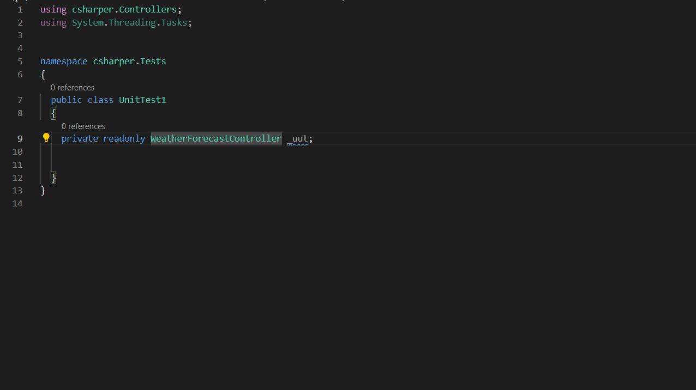

# csharper README

This is a Work in progress.

Extension for mocking out constructor dependencies easily by only specifying the unit under test. Currently only works with Moq as the mocking tool and only C#.

Once declared your unit under test in a `*Tests` file, a quick fix will become availabe for mocking out the constructor dependencies. 

## Features

Mocking out dependencies for a constructor using quick fix

Also includes a snippet for initializaing private readonly members

## Requirements

* Moq (nuget package)
* Xunit (nuget package)

## Extension Settings

This extension contributes the following settings:

* No Settings for now

## Known Issues

* Omnisharp doesn't recognize the inserted mockings until it's been restarted or vscode reloaded.
* The inserted mockings can be below the test class scope if there is not sufficient space before

## Release Notes

### 0.1.0

* Inserting all using statements which are not present in test file
* Try fixing too much white3space

### 0.0.3

* Proper handling of dependencies with multiple generics

### 0.0.2

* Fixed naming of dependencies with generics
* Fixed issue with dependencies with multiple generics being parsed wrong

### 0.0.1

First alpha release

Mocking dependencies for a class
