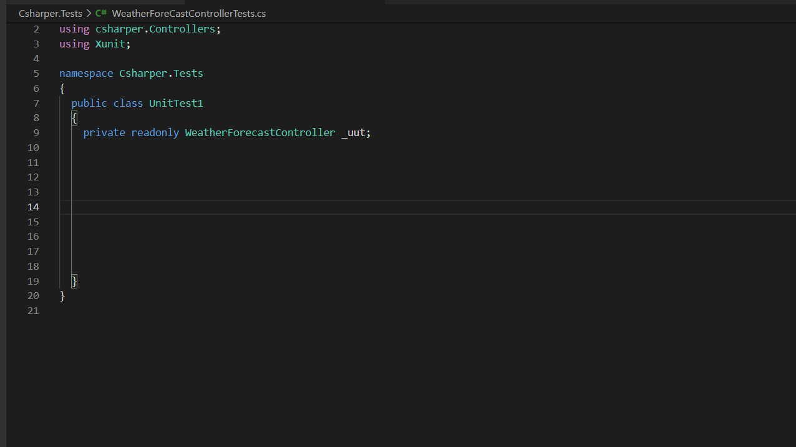

# csharper README

This is a Work in progress.

Extension for mocking out constructor dependencies easily by only specifying the unit under test. Currently only works with Moq as the mocking tool.

## Features

Mocking out dependencies for a constructor using quick fix

## Requirements

* Moq (nuget package)

## Extension Settings

This extension contributes the following settings:

* `csharper.restartOmnisharpAfterMocking`: restart omnisharp server after mocking

## Known Issues

* Omnisharp doesn't recognize the inserted mockings until it's been restarted.
* The inserted mockings can be below the test class scope if there is not sufficient space before
* Using statements for the inserted dependencies are not inserted

## Release Notes

### 0.0.1

First alpha release

Mocking dependencies for a class
